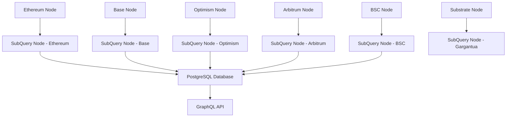

# Hyperbridge Indexer

A multi-chain indexer for the Hyperbridge Protocol that tracks cross-chain messages, assets, and protocol metrics across multiple networks.

# Overview

The Hyperbridge Indexer uses SubQuery to index and track:

- Cross-chain message delivery
- Asset transfers and teleports
- Protocol performance metrics
- Relayer activities
- Chain state updates

# Supported Networks

- Ethereum Sepolia
- Base Sepolia
- Optimism Sepolia
- Arbitrum Sepolia
- BSC Chapel
- Hyperbridge Gargantua (and other Substrate based chains)

# Architecture

The indexer runs multiple SubQuery nodes, each dedicated to a specific chain:



# Key Features

- Multi-chain event tracking
- Asset transfer monitoring
- Protocol metrics collection
- Relayer performance tracking
- Cross-chain message indexing
- State machine updates

# Getting Started

## Prerequisites

- Docker and Docker Compose
- Node.js 16+
- NPM

## Installation

- Clone the repository:

```bash
git clone https://github.com/polytope-labs/hyperbridge-indexer.git
cd hyperbridge-indexer
```

- Install dependencies:

```bash
npm install   // you can use --legacy-peer-deps flag to install legacy dependencies
```

## Configuration

- Configure the indexer by editing the `.env` file.
- Set the database connection details and the RPC endpoints for each chain. You can use the sammple `.env.example` file as a template.

## Running the Indexer

- Start the indexer:

```bash
npm run dev  // for testnet

npm run prod  // for mainnet
```

This launches:

- PostgreSQL database
- SubQuery nodes for each chain
- GraphQL endpoint ([http://localhost:3000/graphql](http://localhost:3000/graphql))

## GraphQL API

The Hyperbridge GraphQL indexer API can be found at [Hyperbridge Indexer API](https://explorer.subquery.network/subquery/polytope-labs/hyperbridge-indexers?stage=true), alongside detailed documentation

# Contributing

- Fork the repository
- Create feature branch
- Commit changes
- Open pull request
